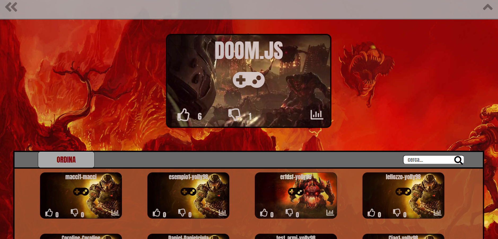

  

# DoomJs

Doomjs is one of my first projects (2018/2019) of which I am very proud and fond despite the fact that I was definitely inexperienced in writing code and organising projects.

It's a web 2D game inspirated to the famous Bethesda game Doom, there is an editor to make and share maps. 
There are statistichs and rating, the database is sql because was a requirement, would be more adapted a Document DB like MongoDB.
All the game is build in pure code, no framework or graphic engine.

All graphic components of the game except the wallpapers and icons are hand-drawn by myself.

## Main Features
* Sign-up and sign-in
* Show own gane statistics
* Browse the main map and maps made by other users
* Like or dislike a map
* Show map top player
* Play a map
* Create a map and share

## About the game
* The Doom guy can jump, squat and shot.
* The player is the Doom guy and can use different weapons
* There are several type of enemies with different behaviors.
* There boxes with inside random quntity of ammo or medkit.
* There are checkpoints and trigger
* Different type of physical object used to buld a map (door, door with key, elevetor, floor, wall, portal)

## About the editor
* Every section of the editor is commented like a tutorial
* Is possible to disble the comments
* Every element of the main map is available in the map editor
* It's possibile remove in the editor the gravity effects and collisions with the enemies

## Technologies used
* javascript
* php
* ajax
* json
* html
* css
* sql and mysql

Note: The project is in italian language.

## Some Screenshots
A screenshot of the main level of the game.

  

A screenshot of the editor while creating a new level.

  

A screenshot of the main page showing all the levels shared by users.

  

A screenshot of the score panel of the main level.

  

## try the game
http://doomjs.altervista.org/giochi/Doom/doomJS.php

